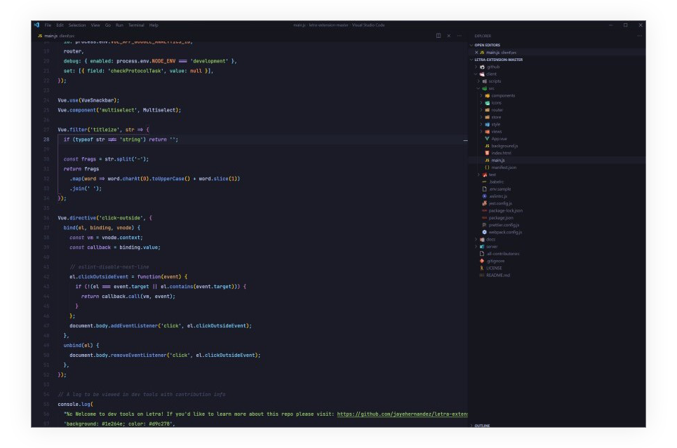

# Visual Studio Code Setup

This is a backup of my Visual Studio Code [settings](./settings.json) and keyboard bindings ([Windows](./keybindings/windows/keybindings.json), [macOS](./keybindings/macos/keybindings.json)) to easily share with others, and for myself in case sync fails 🙃

# Theme Extensions
## Theme
I use the [Tokyo Night](https://marketplace.visualstudio.com/items?itemName=enkia.tokyo-night) theme by [enkia](https://marketplace.visualstudio.com/publishers/enkia).

## Icons
I use [VSCode Icons](https://marketplace.visualstudio.com/items?itemName=vscode-icons-team.vscode-icons) by [VS Code Icons Team](https://marketplace.visualstudio.com/publishers/vscode-icons-team).
