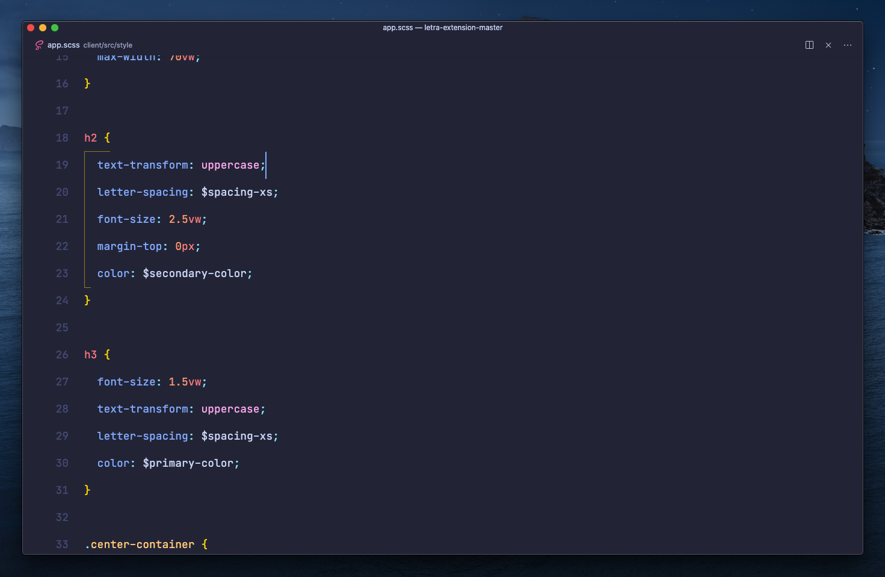

# Visual Studio Code Setup

A backup of my Visual Studio Code [settings](./settings.json) and keyboard bindings ([Windows](./keybindings/windows/keybindings.json), [macOS](./keybindings/macos/keybindings.json)) to easily share with others, and for myself in case sync fails 🙃

# Theme Extensions
### Theme
I use the [Moonlight II](https://github.com/atomiks/moonlight-vscode-theme) theme by [atomiks](https://github.com/atomiks).

### Icons
I use the light version of [City Light's Official Icon Package](https://github.com/Yummygum/city-lights-icons-vsc) by [Yummygum](https://github.com/Yummygum).

